# TrustWork Implemented Functionality and Workflow Document

Prepared for: TrustWork Client and Project Stakeholders  
Prepared on: 2026-05-20  
Scope source: `trustwork-backend` and `escrow-microservice` source code  
Document type: Implemented functionality and workflow document

## 1. Purpose

This document explains the functionality that is implemented in the TrustWork platform and how the workflows operate across the mobile app-facing APIs, the TrustWork backend, and the escrow microservice.

This is not a future requirements document. It documents the implemented features, code flow, service interactions, database entities, and operational workflows currently represented in the backend codebases.

## 2. Scope and Assumptions

The available source code contains:

- TrustWork backend service: Django REST APIs for users, profiles, projects, bids, chat, CMS, notifications, referrals, subscriptions, and payment-facing workflows.
- Escrow microservice: Django REST APIs and Celery tasks for MTN MoMo, Orange Money, Stripe collection/disbursement, escrow event tracking, and callback synchronization to TrustWork.

The mobile app source code was not available in this workspace. Therefore, the Mobile App section is derived from implemented mobile-facing backend APIs and the workflows those APIs enable.

## 3. High-Level System Overview

TrustWork is implemented as two interconnected backend systems:

- `trustwork-backend`: Owns product/business data such as users, profiles, projects, bids, chat, CMS, notifications, subscriptions, referral rules, and TrustWork transaction records.
- `escrow-microservice`: Owns payment-provider orchestration, escrow records, provider transaction references, webhook handling, and status callbacks to TrustWork.

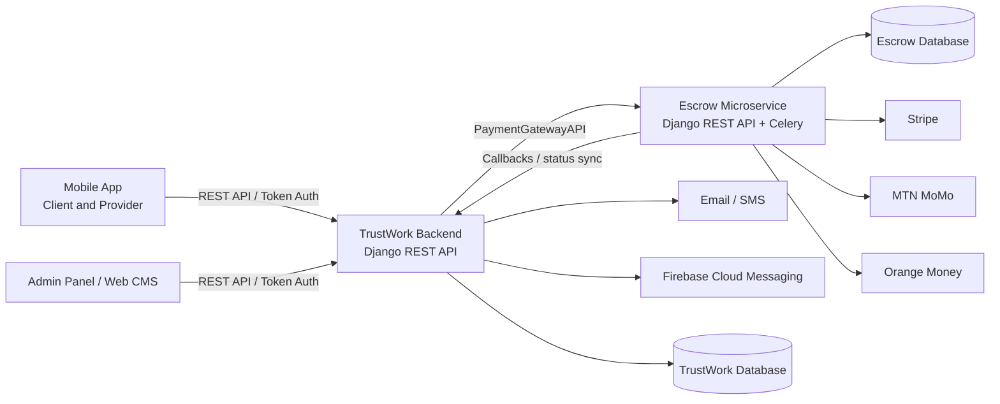

## 4. Architecture Components

### 4.1 TrustWork Backend

Technology:

- Python 3.12
- Django
- Django REST Framework
- Token authentication
- PostgreSQL
- Redis and Django Channels for chat/websocket support
- Firebase Admin SDK for push notifications
- Stripe SDK for connected account onboarding and payment utilities

Implemented Django apps:

- `customuser`: Custom user model, authentication-related user state, referral codes, FCM/device fields.
- `profile_management`: Profile, bank details, documents, subscriptions, membership, coupons, previous work, app referral content.
- `project_management`: Projects, bids, feedback, TrustWork transaction ledger, currency.
- `chat_management`: Chat rooms, messages, attachments, push notifications.
- `content_management`: Landing/mobile CMS content for home, about, contact, terms, privacy, pricing, referral, download.
- `adminsite_management`: CMS, FAQ, QMS, admin analytics, XAF currency management.
- `master`: Locations and job categories.
- `payment_handle`: Escrow gateway wrapper and legacy payment objects/webhooks.
- `api`: API-layer views, serializers, routing, pagination, webhooks.
- `core`: Settings, URLs, auth middleware, ASGI/WSGI, WebSocket routing, response rendering.

### 4.2 Escrow Microservice

Technology:

- Python 3.12
- Django
- Django REST Framework
- PostgreSQL
- Celery and Redis
- Stripe SDK
- MTN MoMo provider APIs
- Orange Money provider APIs

Implemented Django apps:

- `user_management`: Local mirrored users for escrow payer/payee metadata.
- `escrow_management`: Escrow records, escrow events, provider transactions, MTN collection/disbursement/subscription, Stripe collection/disbursement.
- `orange_management`: Orange Money project payments and Orange subscription payments.
- `payment_handler`: Provider-specific gateway clients and webhook endpoints.
- `core`: Service settings, routing, Celery setup.

## 5. Mobile App Functional Scope

The mobile app interacts primarily with `/api/` endpoints in TrustWork backend. Mobile users are either clients or service providers, and a user may switch role through the implemented role-switching API.

### 5.1 Mobile Authentication and Account Lifecycle

Implemented capabilities:

- User registration with email/phone, password, user type, and optional referral code.
- OTP generation and verification.
- Phone OTP delivery uses the TrustWork backend SMS helper in `utils.py`, which requests a short-lived token from `auth.sms.to` and sends messages through `api.sms.to/sms/send`.
- Login using credentials.
- Token-based API access after login.
- Device token and device type storage for Firebase push notifications.
- Password reset, OTP-based verification, password change, and logout.
- Dummy user delete endpoint for account deletion handling.

Key API areas:

| Function | Endpoint examples |
|---|---|
| Register | `POST /api/register/`, `POST /api/user/register/` |
| Verify registration OTP | `POST /api/verify-otp/` |
| Login | `POST /api/login/` |
| Logout | `POST /api/logout/` |
| Password reset | `POST /api/password-reset/`, `GET /api/password-reset-confirm/<uidb64>/<token>/`, `PATCH /api/password-reset-complete/` |
| OTP auth flow | `POST /api/generate-otp/`, `POST /api/otp-verify/`, `POST /api/resend-otp/` |
| Change password | `POST /api/change-password/`, `PATCH /api/profile/change_password/` |
| Delete account | `DELETE /api/user/delete/` |

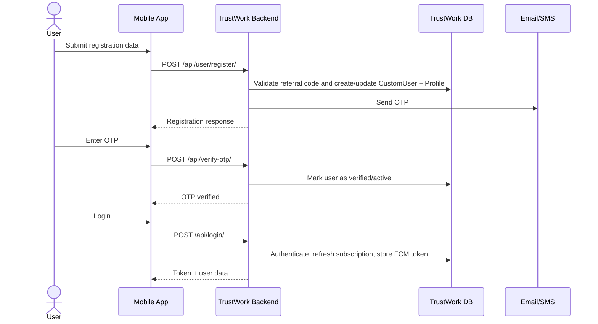

### 5.2 Mobile Profile and Service Provider Setup

Implemented capabilities:

- View and update own profile.
- Upload profile picture and cover image.
- Store organization details, service details, bio, profession, address, location, and job categories.
- Add previous work images.
- Add and manage user documents.
- Add bank or payout account details.
- Mark one bank/payment account as primary.
- Verify provider payment-readiness through active bank/MTN/Stripe account state.

Key API areas:

| Function | Endpoint examples |
|---|---|
| Current profile | `GET/PUT /api/profile/` |
| Profile details | `GET /api/profile/details`, `GET /api/profile/details/<pk>` |
| Cover image | `PATCH /api/profile/update-cover-image/` |
| Documents | `GET/POST /api/user-documents/`, `PUT/DELETE /api/user-documents/<pk>/` |
| Bank details | `GET/POST /api/bank-details/`, `DELETE /api/bank-details/<pk>/` |
| Primary account | `PUT /api/bank-primary/<pk>/` |
| Previous works | `GET/POST /api/previous-works/`, `DELETE /api/previous-works/<pk>/` |
| Payment status | `POST /api/profile/payment-status/` |

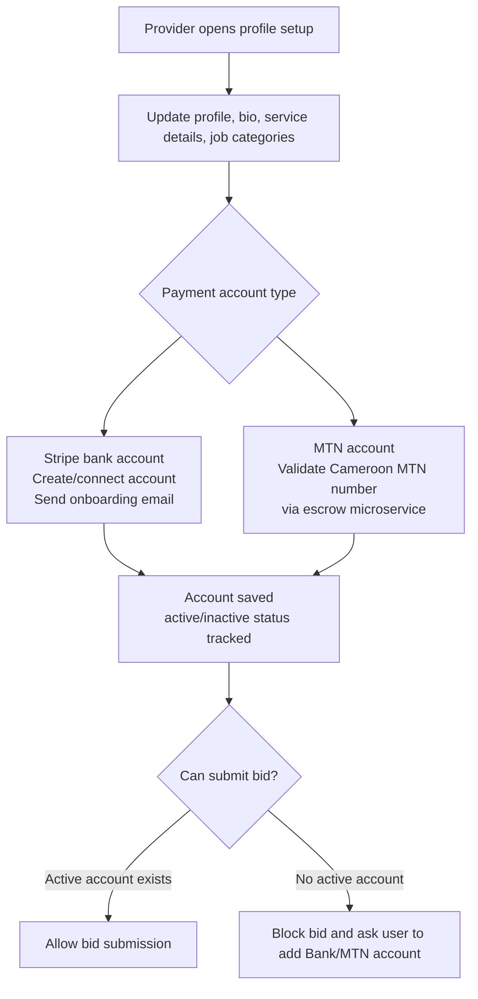

### 5.3 Mobile Client Project Workflow

Implemented capabilities:

- Client creates a project.
- Project includes title, category, description, address/location, budget, timeline, weekly hours, document, and status.
- Client lists own projects with status and search filters.
- Client views, updates, deletes, or changes status.
- Client sees provider bids for a project.
- Client accepts or rejects bids.
- On bid acceptance, payment collection may be initiated through MTN, Orange, or Stripe.
- Project moves through active, ongoing, completed, inactive/block/rejected/myoffer statuses.

Key API areas:

| Function | Endpoint examples |
|---|---|
| Create/list mobile projects | `GET/POST /api/mobile/project/add/`, `GET /api/projects` |
| Project details | `GET/PUT/DELETE /api/project/view/<pk>` |
| Change project status | `PUT /api/project/status/change/<pk>/` |
| View project bids | `GET /api/project/bid/<project_id>` |
| Accept/reject bid | `PUT /api/project/bids/<bid_id>/` |
| Direct offer | `POST /api/direct-offer/`, `POST /api/direct-offer/client/` |
| Offer details | `GET/PUT /api/offers/`, `GET/PUT /api/offers/<offer_id>/` |

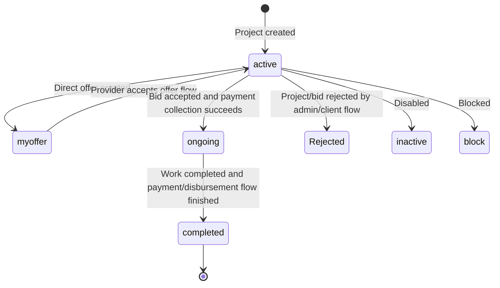

### 5.4 Mobile Service Provider Project and Bid Workflow

Implemented capabilities:

- Provider sees active/relevant projects.
- Provider can filter/list available projects and client projects.
- Provider submits a bid only after having bank/MTN account details.
- Provider can view bid status, direct offers, my offers, and service details.
- Provider receives notifications on new projects, bid status changes, payment requests, and payment failures.

Key API areas:

| Function | Endpoint examples |
|---|---|
| Active projects | `GET /api/mobile/project/view/list`, `GET /api/projects/service-providers/` |
| Provider project list | `GET /api/service-providers/projects/` |
| Submit bid | `POST /api/mobile/bid/add/`, `POST /api/bid/add/` |
| Bid details | `GET/PUT/DELETE /api/bid/details/<pk>` |
| Provider offers | `GET /api/provider/myoffers/` |
| Provider project view | `GET /api/provider/view/project` |
| Service details | `GET /api/provider/<provider_id>/service/<job_category_id>/` |

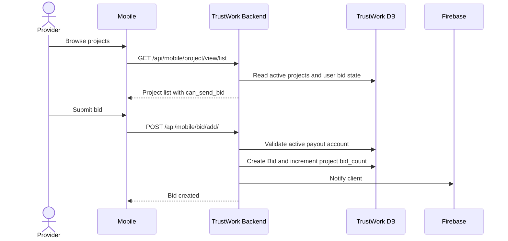

### 5.5 Mobile Payment Workflows

Implemented mobile-facing payment capabilities:

- Client pays for accepted bid using MTN MoMo collection.
- Client pays for accepted bid using Orange Money.
- Client pays using Stripe payment intent/client secret.
- Provider payout/disbursement is handled through MTN or Stripe depending on stored payout account and payment flow.
- Mobile can check payment status and transaction history.
- Provider can send payment request notification to client.
- Failed payment state can be marked for a bid.

Key API areas:

| Function | Endpoint examples |
|---|---|
| MTN project payment | `PUT /api/project/bids/<bid_id>/` with payment phone/action |
| Orange project payment | `POST /api/orange/pay/` |
| Orange project status | `GET /api/status/<txn_id>/`, `GET /api/paymentstatus/<pay_token>/` |
| Stripe checkout/payment | `POST /api/api/checkout-session/` |
| Stripe payment status | `GET /api/api/payment-status/` |
| Stripe webhook sync | `POST /api/stripe-webhook/` |
| Stripe payout | `POST /api/stripe-bank-payout/` |
| Payment history | `GET /api/service-provider/payment-history/` |
| Pending payments | `GET /api/membership-payment-pending/list/` |
| Payment request | `POST /api/send-payment-request/` |

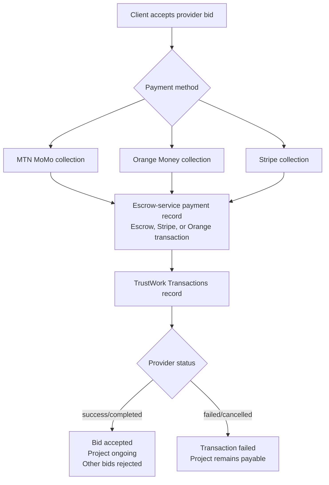

### 5.6 Mobile Subscription Workflow

Implemented capabilities:

- Subscription can be initiated through MTN MoMo or Orange Money.
- Escrow microservice validates payment and generates a subscription code.
- TrustWork sends subscription code to user via email/SMS.
- SMS subscription-code delivery uses the same `utils.py` SMS gateway helper as OTP delivery.
- User submits code to activate membership.
- TrustWork creates a `Subscriptions` record, marks old subscriptions inactive, sets expiry, and marks profile as payment verified.
- Google Play and App Store webhook endpoints exist for store subscription notifications.
- Referral rewards are applied for successful subscription activation.

Key API areas:

| Function | Endpoint examples |
|---|---|
| Initiate MTN subscription | `POST /api/send_subscription_request/` |
| Initiate Orange subscription | `POST /api/send_orange_subscription_request/` |
| Send subscription code callback | `POST /api/send_subscription_code/` |
| Validate subscription code | `POST /api/check_subscription_codes/`, `POST /api/check_orange_subscription_codes/` |
| In-app subscription handling | `POST /api/handle_subscription/` |
| Store webhooks | `POST /api/webhooks/google-play/`, `POST /api/webhooks/app-store/` |

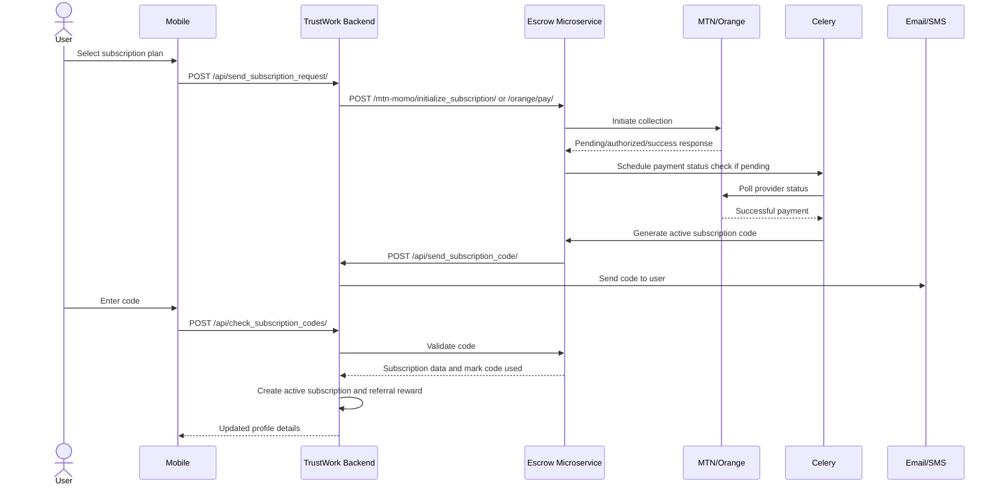

### 5.7 Mobile Chat and Notifications

Implemented capabilities:

- Create or reuse chat room between users.
- List chat rooms.
- List chat messages.
- Send chat messages.
- Upload attachments through message attachment APIs.
- WebSocket route is available for real-time chat channel.
- Notification list, read status, and status toggles.
- Firebase push notification delivery for project, bid, payment, and custom notification events.

Key API areas:

| Function | Endpoint examples |
|---|---|
| Create chat room | `POST /api/create_chat_room/` |
| Message list | `GET /api/chat_messages/list/<chat_id>/` |
| Chat room list | `GET /api/list_chat_rooms/` |
| Send notification | `POST /api/notifications/send/` |
| List notifications | `GET /api/notifications/` |
| Change notification status | `POST /api/notifications_status_change/` |
| Mark read | `PUT /api/notification_read_status/<pk>/` |
| WebSocket | `ws/chat/<stream_name>/` |

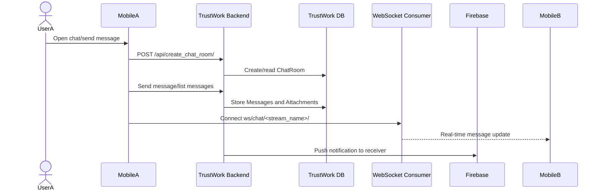

### 5.8 Mobile CMS and Static Content

Implemented capabilities:

- Home page content.
- About us page content.
- Contact us content and contact form.
- Terms and conditions.
- Privacy policy.
- Features.
- How it works.
- Packages/pricing.
- Referral content.
- App download links.

Key API areas:

| Function | Endpoint examples |
|---|---|
| Home page | `GET /api/home-page/` |
| About | `GET /api/aboutus-page/` |
| Contact | `GET /api/contactus-page/`, `POST /api/contactus-form/` |
| Terms | `GET /api/terms-conditions-page/` |
| Privacy | `GET /api/privacy-policy-page/` |
| App info/features | `GET /api/app-info/`, `GET /api/app-features/` |
| How it works | `GET /api/app-howitworks/` |
| Packages | `GET /api/app-packages/` |
| Referral/download | `GET /api/app-referral/`, `GET /api/app-download/` |

## 6. Backend Functional Scope

### 6.1 TrustWork Backend API Responsibilities

TrustWork backend is the business-domain system. It owns:

- User identity and role state.
- Profile and provider service data.
- Project and bid lifecycle.
- Business-facing transaction status.
- Referral/coupon/subscription state.
- CMS/admin content.
- Notifications and chat state.
- Integration calls to escrow microservice.

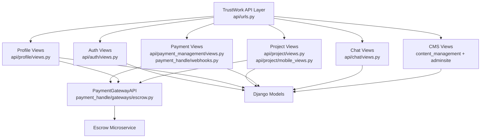

### 6.2 Escrow Microservice Responsibilities

Escrow microservice owns provider/payment orchestration:

- Create escrow records when TrustWork initiates collection.
- Maintain event history for collection/disbursement.
- Store provider transaction references.
- Talk to MTN MoMo, Orange Money, and Stripe.
- Receive provider webhooks.
- Notify TrustWork when payment state changes.
- Generate and validate subscription codes for MTN/Orange subscription payments.

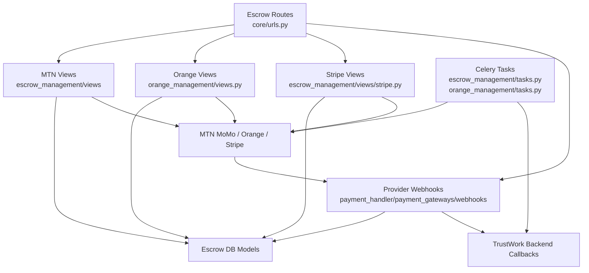

## 7. End-to-End Workflow Details

### 7.1 Client Creates Project and Provider Bids

Code flow:

1. Mobile client calls TrustWork project creation endpoint.
2. TrustWork validates client profile and selected job category.
3. `ProjectSerializer` creates or reuses a `Location` by latitude/longitude/country/code.
4. `Project` record is saved.
5. `project_post_save_handler` sends notifications to related providers by job category.
6. Providers list projects and submit bids.
7. Bid creation increments project bid count and triggers notification to client.

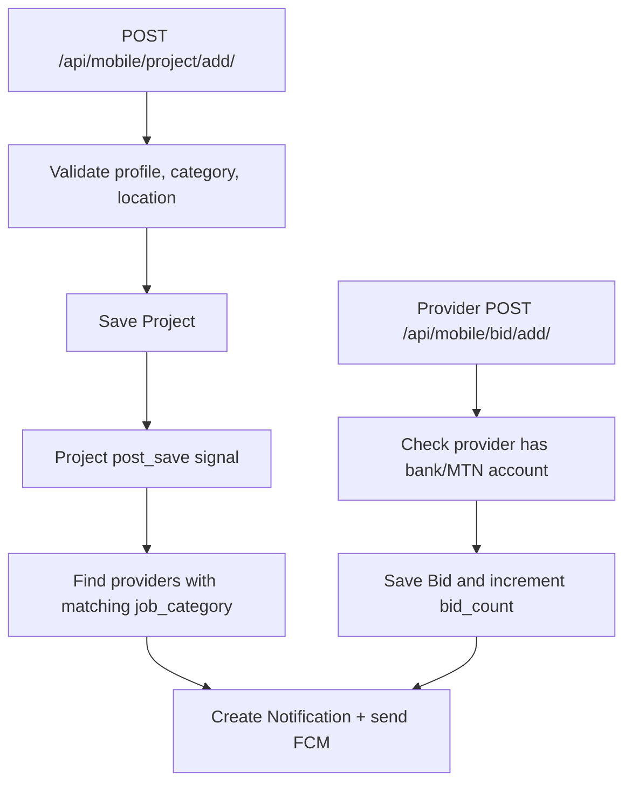

### 7.2 Bid Acceptance and MTN Collection

Code flow:

1. Client accepts bid through `ProjectBidApiView.put`.
2. TrustWork normalizes Cameroon MTN phone number.
3. TrustWork calls `PaymentGatewayAPI.initialize_collection`.
4. Escrow microservice creates local `User`, `Escrow`, `Events`, and `Transactions`.
5. Escrow calls MTN request-to-pay.
6. Escrow returns pending/success/failed provider status.
7. TrustWork creates or updates `project_management.Transactions`.
8. If successful, bid becomes `Accepted`, other bids become `Rejected`, project becomes `ongoing`.
9. Webhooks/status sync can later update TrustWork through `/api/webhooks/escrow_collection/`.

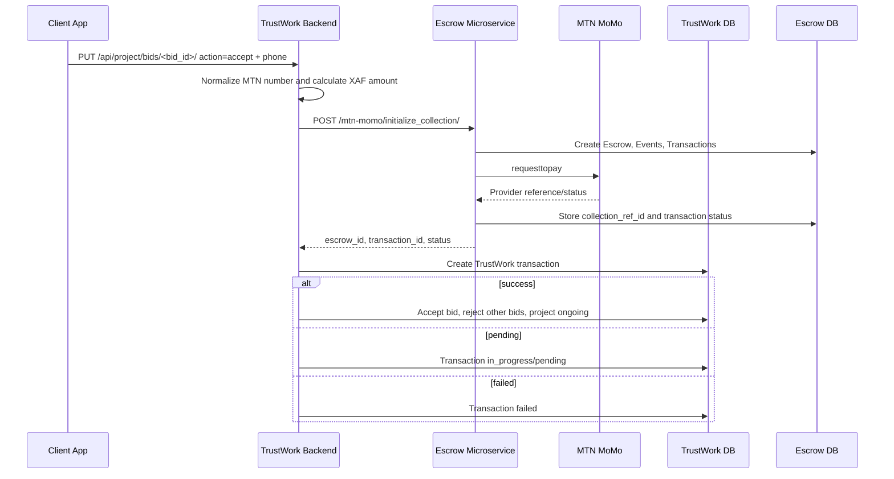

### 7.3 Orange Money Project Payment

Code flow:

1. Mobile calls TrustWork `/api/orange/pay/`.
2. TrustWork validates bid and amount, normalizes Orange number, and calls escrow `/orange/pay/`.
3. Escrow validates required fields and creates an `OrangePayTransaction`.
4. Escrow calls Orange initiate payment API.
5. If pending/authorized, escrow schedules Celery polling.
6. Orange provider can notify escrow through `/orange/notify/`.
7. Escrow updates transaction and calls TrustWork `/api/orange_payment_success/`.
8. TrustWork syncs `Transactions`, bid status, and project status.

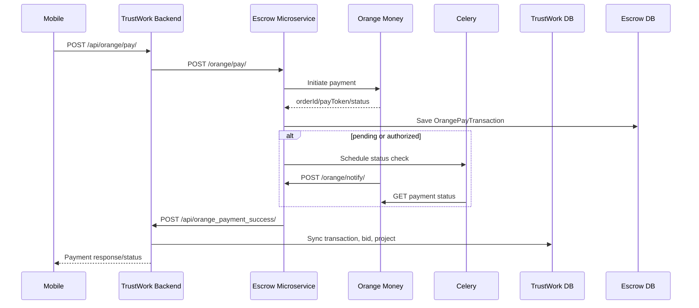

### 7.4 Stripe Collection and Disbursement

Collection code flow:

1. TrustWork calls `PaymentGatewayAPI.initialize_stripe_payment`.
2. Escrow creates `Escrow` and collection `Transactions`.
3. Escrow creates Stripe PaymentIntent and returns client secret/session information.
4. Stripe collection webhook updates escrow transaction and escrow status.
5. TrustWork can process session status and update TrustWork transaction/project/bid records.

Disbursement code flow:

1. Provider bank account is created/connected in TrustWork using Stripe account onboarding.
2. TrustWork calls escrow `/stripe/initialize_disbursement/`.
3. Escrow creates Stripe transfer/payout transaction.
4. Stripe payout webhook updates escrow state.
5. Escrow calls TrustWork `/api/stripe-payment-status/` to sync disbursement status.

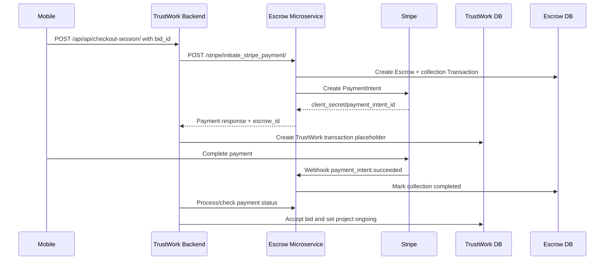

### 7.5 Project Completion and Provider Payment Request

Implemented capabilities:

- Provider can send payment request notification to client.
- Client/admin can change project status to completed.
- Disbursement can be initiated through MTN or Stripe after collection success and completion state.
- Service provider payment history is generated from disbursement transactions.

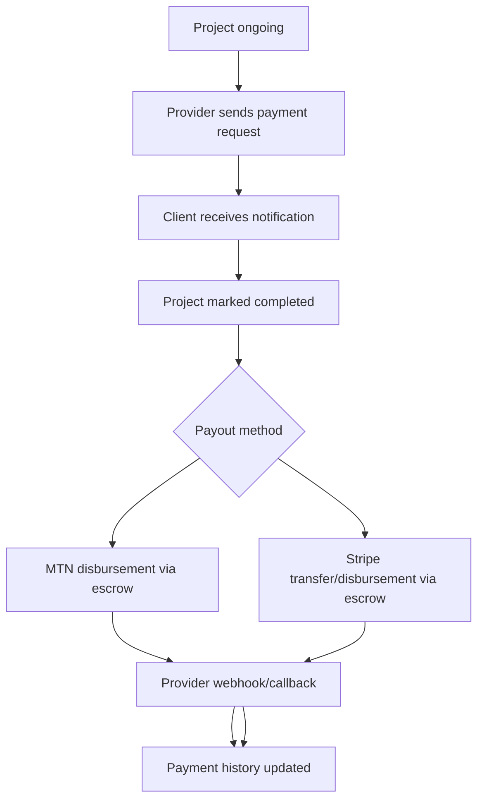

### 7.6 Referral and Coupon Workflow

Implemented capabilities:

- Every `CustomUser` receives a generated referral code.
- Registration validates optional referral code.
- Referral handler can add referral relationship.
- Successful subscription activation can trigger referral reward logic.
- Coupon and discount fields are tracked on user/profile.
- Login refreshes coupon discount state.
- App referral content is managed via CMS-like API.

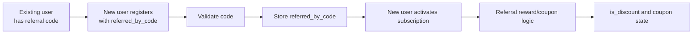

## 8. Database and Data Model

### 8.1 TrustWork Core Database ER Diagram

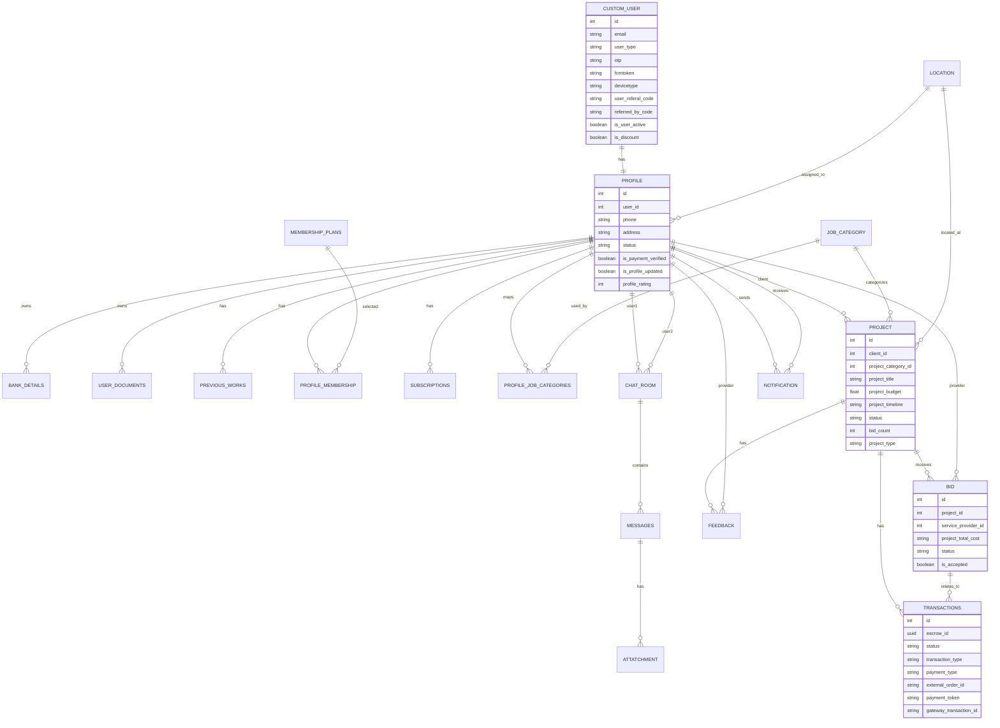

### 8.2 Escrow Microservice Database ER Diagram

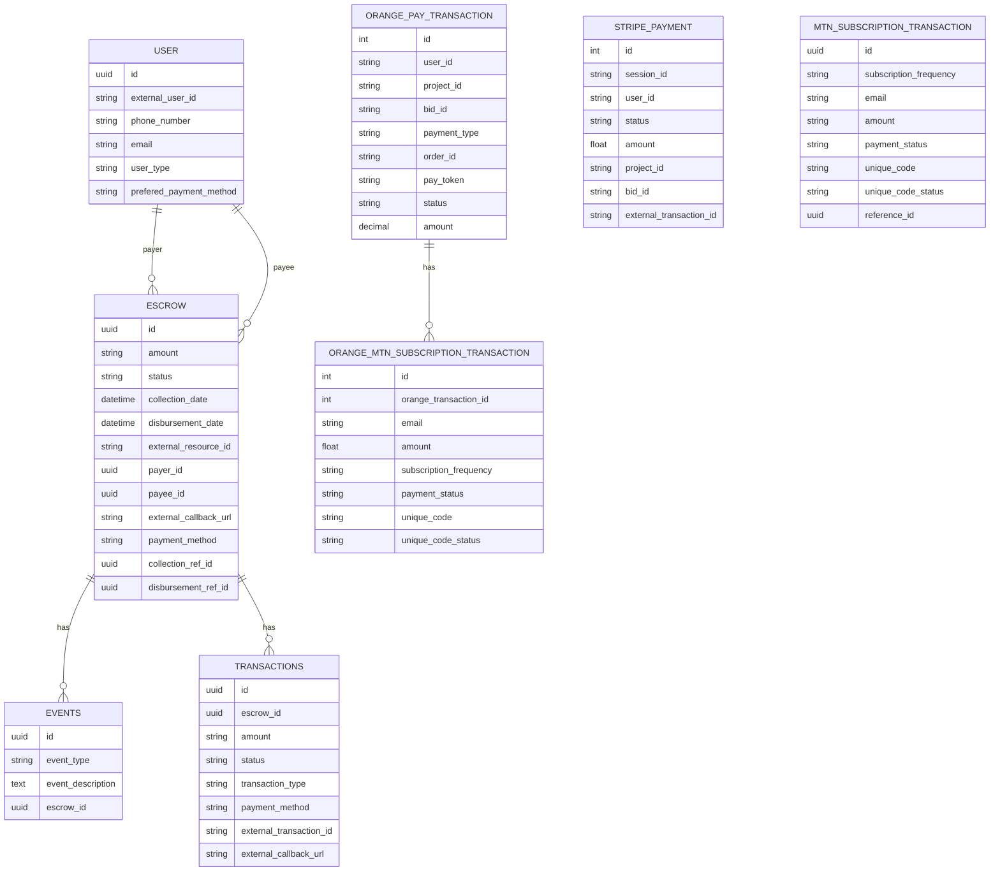

### 8.3 TrustWork CMS Database Model

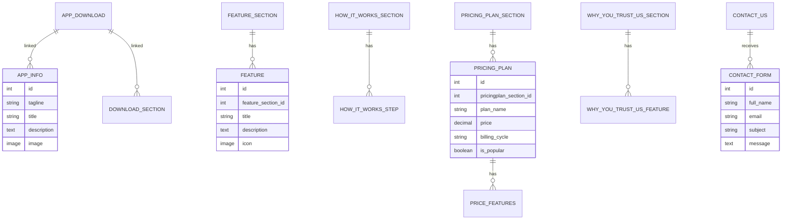

## 9. UML Class Diagrams

### 9.1 TrustWork Business Domain Classes

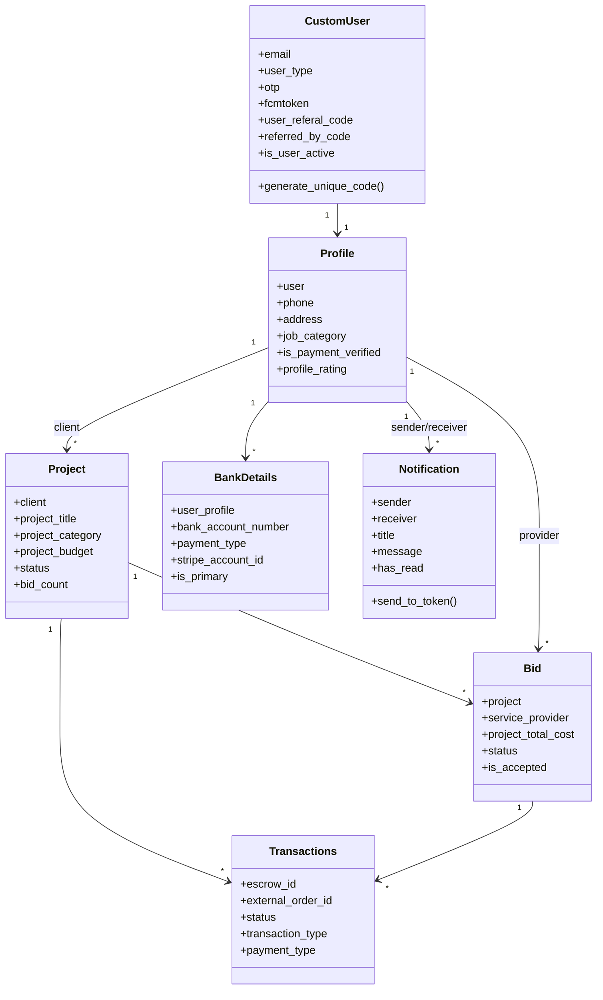

### 9.2 Escrow Payment Domain Classes

```mermaid
classDiagram
    class User {
        +external_user_id
        +phone_number
        +email
        +user_type
    }

    class Escrow {
        +amount
        +status
        +payer
        +payee
        +external_resource_id
        +payment_method
        +collection_ref_id
        +disbursement_ref_id
    }

    class Events {
        +event_type
        +event_description
        +escrow
    }

    class Transactions {
        +escrow
        +amount
        +status
        +transaction_type
        +payment_method
        +external_transaction_id
    }

    class OrangePayTransaction {
        +order_id
        +pay_token
        +subscriber_msisdn
        +amount
        +status
        +is_success()
        +is_failed()
        +is_pending()
    }

    class MtnSubscriptionTransaction {
        +subscription_frequency
        +email
        +amount
        +payment_status
        +unique_code
        +reference_id
    }

    User "1" --> "*" Escrow : payer
    User "1" --> "*" Escrow : payee
    Escrow "1" --> "*" Events
    Escrow "1" --> "*" Transactions
    OrangePayTransaction "1" --> "*" OrangeMtnSubscriptionTransaction
```

## 10. Admin and Backend Operations

### 10.1 Admin User Management

Implemented capabilities:

- Admin login.
- List client/provider/admin users.
- Add, edit, delete, and status-change user profiles.
- Search users by user type.
- View dashboard analytics.
- Manage user profile activation/blocking/deletion.

Key API areas:

| Function | Endpoint examples |
|---|---|
| Admin login | `POST /api/admin/login/` |
| User lists | `GET /api/admin/<user_type>/list` |
| User details | `GET /api/admin/<user_type>/details/<pk>/` |
| Add user | `POST /api/admin/<user_type>/add/` |
| Edit user | `PUT /api/admin/<user_type>/edit/<pk>/` |
| Delete user | `DELETE /api/admin/<user_type>/delete/<pk>/` |
| Status change | `PUT /api/admin/<user_type>/status/change/<pk>/` |
| Dashboard | `GET /api/admin/dashboards/analytics/` |

### 10.2 CMS and Content Management

Implemented capabilities:

- CMS pages, FAQ, QMS, and QMS response management.
- Home page app sections.
- About, trust-us, contact, terms, privacy.
- Feature, how-it-works, package/pricing, referral, and download sections.
- Contact form collection.

Key API areas:

| Function | Endpoint examples |
|---|---|
| CMS list/add/details/edit/delete | `/api/cms/list/`, `/api/cms/add/`, `/api/cms/details/<pk>/`, `/api/cms/edit/<pk>/`, `/api/cms/delete/<pk>/` |
| FAQ management | `/api/faq/list/`, `/api/faq/add/`, `/api/faq/edit/<pk>/`, `/api/faq/delete/<pk>/` |
| QMS management | `/api/qms/list/`, `/api/qms/add/`, `/api/qms/response/create/` |
| Home CMS | `/api/app-info/`, `/api/app-features-cms/`, `/api/app-howitworks-cms/`, `/api/app-packages-cms/` |
| Terms/privacy CMS | `/api/terms-conditions-cms/`, `/api/privacy-policy-cms/` |
| Contact form | `/api/contactus-form/`, `/api/contactus-form/<pk>/` |

### 10.3 Master Data

Implemented capabilities:

- Location listing.
- Job category listing and CRUD.
- XAF currency conversion value management.

Key API areas:

| Function | Endpoint examples |
|---|---|
| Locations | `GET /api/location/list/` |
| Job categories | `GET /api/job_category/list/`, `/api/category/`, `/api/category/add/`, `/api/category/edit/<pk>/` |
| Currency | `GET/POST/PUT /api/admin/xaf_currency/` |

## 11. API Endpoint Summary by Service

### 11.1 TrustWork Backend Main Route Groups

| Area | Representative endpoints |
|---|---|
| API documentation | `/swagger/`, `/redoc/`, `/swagger.json` |
| Authentication | `/api/register/`, `/api/user/register/`, `/api/login/`, `/api/logout/`, `/api/verify-otp/` |
| Password/OTP | `/api/password-reset/`, `/api/generate-otp/`, `/api/otp-verify/`, `/api/resend-otp/` |
| Profiles | `/api/profile/`, `/api/profile/details`, `/api/users/`, `/api/user/<user_type>/list` |
| Bank/documents | `/api/bank-details/`, `/api/bank-primary/<pk>/`, `/api/user-documents/` |
| Projects | `/api/project/list/`, `/api/project/add/`, `/api/mobile/project/add/`, `/api/projects` |
| Bids/offers | `/api/bid/list/`, `/api/mobile/bid/add/`, `/api/project/bids/<bid_id>/`, `/api/direct-offer/` |
| Feedback | `/api/projects/<project_id>/feedback/`, `/api/feedback/<project_id>/` |
| Chat | `/api/create_chat_room/`, `/api/chat_messages/list/`, `/api/list_chat_rooms/` |
| Notifications | `/api/notifications/`, `/api/notifications/send/`, `/api/notification_read_status/<pk>/` |
| Subscriptions | `/api/send_subscription_request/`, `/api/check_subscription_codes/`, `/api/handle_subscription/` |
| Payments | `/api/api/checkout-session/`, `/api/orange/pay/`, `/api/stripe-webhook/`, `/api/stripe-bank-payout/` |
| Webhooks | `/api/webhooks/escrow_collection/`, `/api/webhooks/escrow_disbursement/`, `/api/webhooks/google-play/`, `/api/webhooks/app-store/` |
| CMS | `/api/home-page/`, `/api/aboutus-page/`, `/api/contactus-page/`, `/api/terms-conditions-page/`, `/api/privacy-policy-page/` |

### 11.2 Escrow Microservice Main Route Groups

| Area | Representative endpoints |
|---|---|
| Health | `/ok/`, `/orange/ok/` |
| MTN account checks | `/mtn-momo/mtn_account_status/`, `/mtn-momo/mtn_account_add_status/` |
| MTN collection | `/mtn-momo/initialize_collection/`, `/mtn-momo/get_collection_status/<txn_id>` |
| MTN disbursement | `/mtn-momo/initialize_disbursement/`, `/mtn-momo/get_disbursement_status/<txn_id>` |
| MTN subscription | `/mtn-momo/initialize_subscription/`, `/mtn-momo/check_subscription_code/` |
| MTN escrow status | `/mtn-momo/escrow_payment_status/<escrow_id>/` |
| Orange payment | `/orange/pay/`, `/orange/notify/`, `/orange/status/<txn_id>/`, `/orange/paymentstatus/<pay_token>/` |
| Orange subscription | `/orange/check_subscription_code/` |
| Stripe collection | `/stripe/initiate_stripe_payment/`, `/stripe/stripe_payment_status/`, `/stripe/api/payment-status-view/<session_id>/` |
| Stripe disbursement | `/stripe/initialize_disbursement/`, `/stripe/webhooks/stripe_escrow_disbursement/` |
| Provider webhooks | `/webhooks/mtn-collection`, `/webhooks/mtn-disbursement`, `/webhooks/stripe/process-session/` |

## 12. Security and Access Control Notes

Implemented controls:

- Token authentication through DRF authtoken.
- Subscription-aware authentication class is configured in TrustWork settings.
- Protected endpoints use `IsAuthenticated` in many mobile/project/profile/payment views.
- Admin endpoints use token-based login and user type driven routes.
- Environment variables are used for API keys and provider credentials.
- Provider webhooks validate Stripe signatures for Stripe flows.
- MTN and Orange phone numbers are normalized before provider calls.
- Local credentials and environment files are ignored in git.

Important observations:

- Several endpoints are explicitly public by design, such as CMS content and provider callbacks.
- Some webhook/payment callback endpoints use `AllowAny` or no authentication because external providers need to call them.
- Stripe webhooks validate signatures; non-Stripe callbacks depend on provider routing and transaction references.
- The mobile app should always send the token received from login for protected workflow APIs.

## 13. Status and Lifecycle Summary

### 13.1 User/Profile Status

```mermaid
stateDiagram-v2
    [*] --> Registered
    Registered --> OTPPending
    OTPPending --> ActiveUser: OTP verified
    ActiveUser --> ProfileIncomplete
    ProfileIncomplete --> ProfileUpdated: Profile saved
    ProfileUpdated --> PaymentUnverified
    PaymentUnverified --> PaymentVerified: Subscription/payment activation
    ActiveUser --> Blocked: Admin/profile status block
    Blocked --> ActiveUser: Admin reactivates
    ActiveUser --> Deleted: User delete
```

### 13.2 Bid Status

```mermaid
stateDiagram-v2
    [*] --> Created
    Created --> Active
    Active --> Accepted: Client accepts
    Active --> Rejected: Client rejects or another bid accepted
    Accepted --> PaymentPending: Collection initiated
    PaymentPending --> Accepted: Payment succeeds
    PaymentPending --> Failed: Payment fails
    Accepted --> Completed: Project completed
```

### 13.3 Escrow Status

```mermaid
stateDiagram-v2
    [*] --> pending
    pending --> collection_success: Collection completed
    pending --> collection_failed: Collection failed
    collection_success --> disbursement_success: Provider payout completed
    collection_success --> disbursement_failed: Provider payout failed
    collection_failed --> [*]
    disbursement_success --> [*]
    disbursement_failed --> [*]
```

## 14. Implemented Integrations

| Integration | Used by | Purpose |
|---|---|---|
| Firebase Cloud Messaging | TrustWork backend | Push notifications for project, bid, payment, and general events |
| Email | TrustWork backend | OTP, password reset, subscription code, Stripe onboarding link |
| SMS.to | TrustWork backend | OTP/subscription code delivery through `utils.py`; credentials are read from `SMS_API_KEY`, `SMS_SECRET_KEY`, and `SMS_CLIENT_ID` |
| Stripe | TrustWork + Escrow | PaymentIntent collection, connected account onboarding, transfers/payouts, webhooks |
| MTN MoMo | Escrow microservice | Account validation, collection, disbursement, subscription payment |
| Orange Money | Escrow microservice | Project payment, subscription payment, status polling, webhook notification |
| Celery/Redis | Escrow microservice | Delayed status checks and retryable TrustWork notifications |
| Django Channels/Redis | TrustWork backend | WebSocket chat routing |

## 15. Implemented Code Flow Map

### 15.1 TrustWork Flow Map

| Feature area | Main files/classes |
|---|---|
| Auth/register/login | `api/auth/views.py`, `api/auth/serializers.py`, `customuser/models.py` |
| Profile/bank/docs/subscriptions | `api/profile/views.py`, `api/profile/serializers.py`, `profile_management/models.py` |
| Project/bid/direct offer/feedback | `api/project/views.py`, `api/project/mobile_views.py`, `api/project/serializers.py`, `project_management/models.py` |
| Notifications/chat | `api/chat/views.py`, `api/chat/serializers.py`, `chat_management/models.py`, `core/consumers.py` |
| Payment gateway wrapper | `payment_handle/gateways/escrow.py` |
| Project/Orange/Stripe payment APIs | `api/payment_management/views.py`, `payment_handle/webhooks.py` |
| CMS/content | `api/content_management_servies/views/*.py`, `content_management/models/*.py`, `api/admin_management/views.py` |
| Master data | `api/master/views.py`, `master/models.py` |

### 15.2 Escrow Flow Map

| Feature area | Main files/classes |
|---|---|
| MTN collection | `escrow_management/views/initiate_collection.py`, `payment_handler/payment_gateways/MTN_MoMo/collection.py` |
| MTN disbursement | `escrow_management/views/initiate_disbursement.py`, `payment_handler/payment_gateways/MTN_MoMo/disbursement.py` |
| MTN subscription | `escrow_management/views/initialize_subscription.py`, `escrow_management/tasks.py` |
| Orange payment/subscription | `orange_management/views.py`, `orange_management/tasks.py`, `payment_handler/payment_gateways/orange/client.py` |
| Stripe collection/disbursement | `escrow_management/views/stripe.py`, `payment_handler/payment_gateways/stripe/collection.py` |
| Provider webhooks | `payment_handler/payment_gateways/webhooks/*` |
| Escrow data model | `escrow_management/models.py`, `orange_management/models.py`, `user_management/models.py` |

## 16. Functional Feature Checklist

### 16.1 Mobile App-Facing Features

| Feature | Implemented backend support |
|---|---|
| Registration/login/OTP | Yes |
| Profile setup/update | Yes |
| Client project creation/list/details | Yes |
| Provider project browsing | Yes |
| Bid creation/status | Yes |
| Bid acceptance/rejection | Yes |
| Direct offers | Yes |
| MTN project payment | Yes |
| Orange project payment | Yes |
| Stripe payment | Yes |
| Provider bank/MTN/Stripe account setup | Yes |
| Subscription payment via MTN/Orange | Yes |
| App store subscription webhook handling | Yes |
| Chat and messages | Yes |
| Push notifications | Yes |
| Feedback and ratings | Yes |
| Referral code and coupons | Yes |
| CMS/static content consumption | Yes |

### 16.2 Backend/Admin Features

| Feature | Implemented support |
|---|---|
| Admin user management | Yes |
| CMS/FAQ/QMS management | Yes |
| Dashboard analytics | Yes |
| Job categories and locations | Yes |
| Currency management | Yes |
| Project/bid administration | Yes |
| Transaction and payment history | Yes |
| Payment provider callbacks | Yes |
| Escrow event tracking | Yes |
| Provider-specific transaction storage | Yes |
| Subscription code validation | Yes |

## 17. Key Business Rules Captured in Code

- A user can register with an optional referral code; invalid referral code blocks registration.
- A user receives a unique referral code automatically.
- Login stores device token and device type for push notification.
- Login refreshes subscription status and coupon/discount state.
- Provider bid submission requires an active bank/MTN account.
- A provider cannot create duplicate active bids for the same project.
- Accepting a bid rejects other bids for the same project.
- Successful collection moves the project toward `ongoing`.
- Project payment referral rewards are intentionally disabled in Orange project-payment flow unless the business approves it.
- Subscription referral rewards are handled after successful subscription activation.
- MTN and Orange Cameroon phone numbers are normalized before gateway calls.
- Stripe connected account onboarding is required before Stripe payout can become active.
- Primary bank account selection unsets the previous primary account.
- Deleting the primary account is blocked when more than one account exists.
- Notification records are created and sent through Firebase when the receiver has an FCM token.

## 18. Document Limitations

- Mobile UI screen-level behavior is inferred from backend API behavior because mobile source code was not available.
- Some endpoints contain legacy/commented code; this document focuses on implemented active code paths.
- Payment statuses depend on external provider responses from MTN, Orange, and Stripe.
- Exact production URLs are environment-driven through `.env` variables such as `TRUSTWORK_BASE_API` and `ESCROW_BASE_API`.

## 19. Recommended Client Presentation Structure

For client sharing, this document can be presented as:

1. Executive system overview.
2. Mobile app workflows by user role.
3. Backend/admin workflows.
4. Payment and escrow workflows.
5. Database/UML diagrams.
6. API summary.
7. Integration and security notes.
